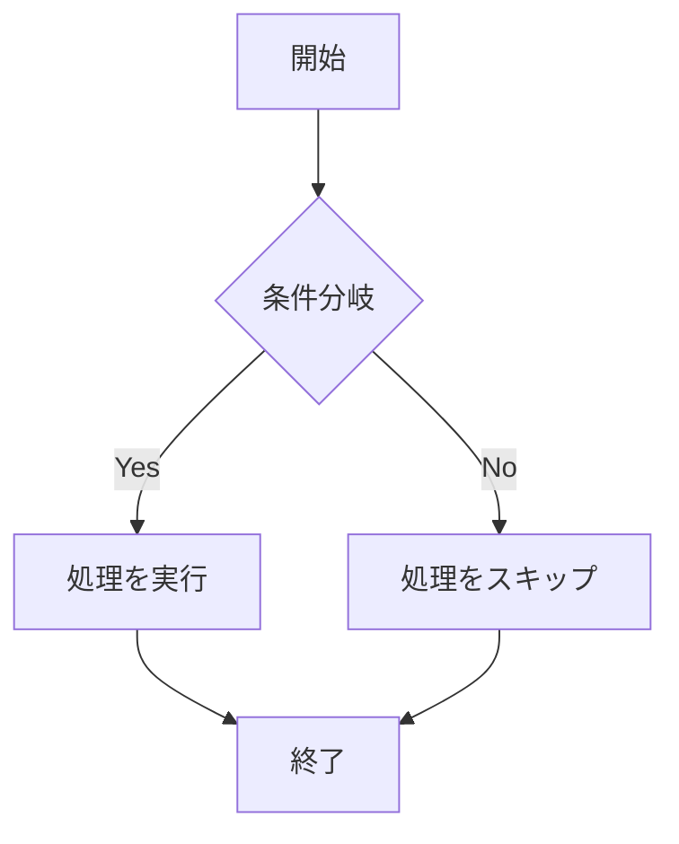
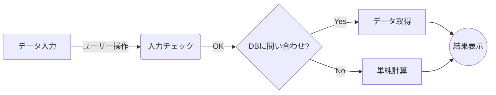
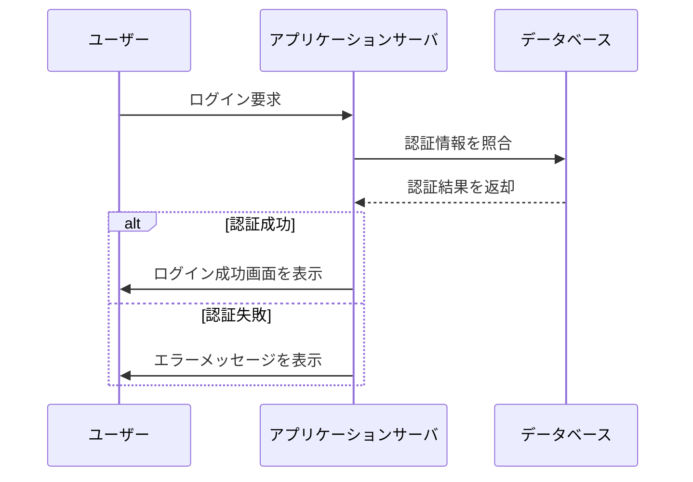
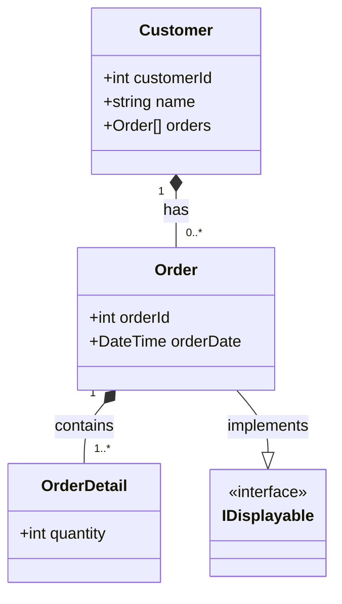
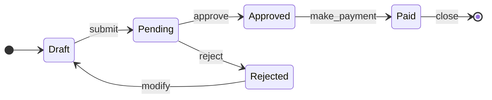
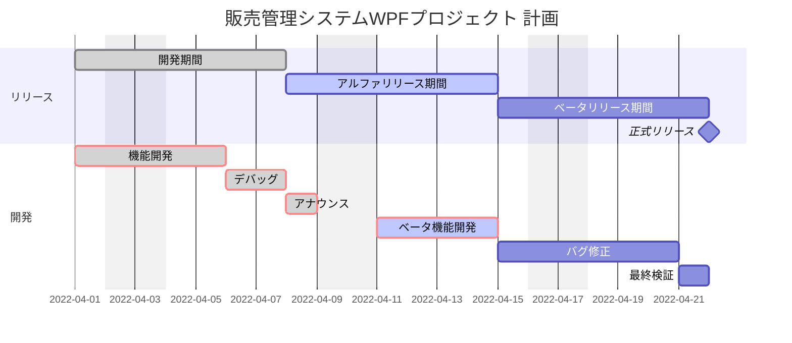
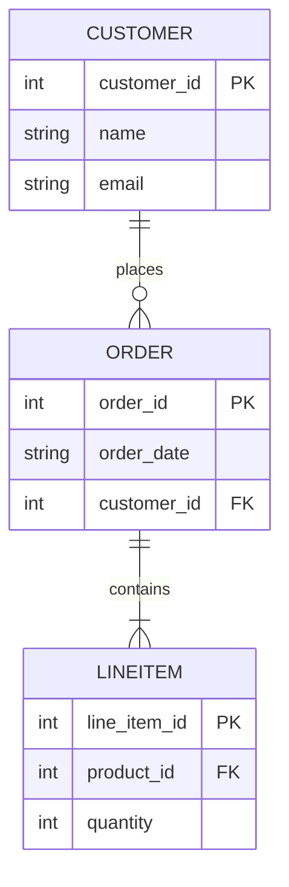

# WPF + MVVM 80分セミナー構成（要約）

| 時間 | セクション | 内容 |
|---:|---|---|
| 5分 | オープニング：WPFとMVVMへの導入 | 1. 今日のゴール：MVVMの「勘所」を短時間で掴む。 2. 従来のWPF開発の課題：Code-Behindにビジネスロジックを書きがち → テスト困難・UI変更に弱い。 WPF や Xamarin、.NET MAUI でよく使われる |
| 10分 | MVVMの概念と誕生の背景 | 1. MVVMとは（目的：関心の分離） — Model / View / ViewModel の役割。 2. 最大のメリット：デザイナーと開発の並行作業、単体テストの容易さ（ViewModelの分離）。 |
| 15分 | MVVMの三種の神器：役割と関係 | 1. View (XAML)：見た目と操作の定義（ロジックは書かない）。 2. Model (C#)：データとビジネスロジック（UI非依存）。 3. ViewModel (C#)：公開プロパティとコマンド、INotifyPropertyChanged の重要性。 |
| 20分 | MVVMの核：データバインディングとコマンド | 1. データバインディング基礎：DataContext の設定、Mode（OneWay / TwoWay）。 2. ユーザー操作の処理：ICommand による伝達、RelayCommand（DelegateCommand）パターン紹介。 |
| 20分 | 実践的トピックとフレームワーク | 1. 導入方法：既存プロジェクトへ段階的に適用する手順。 2. フレームワーク紹介：Prism、Community Toolkit MVVM（推奨）、ReactiveProperty の比較。 |
| 10分 | NPOCOの導入 | DB操作の簡略化 |
| 10分 | まとめとQ&A | 1. 振り返り：分離・テスト・バインディングの重要性。 2. 次のステップ：フレームワーク導入の推奨。 3. 質疑応答。 |
| 合計 |  | 80分 |

# 補足資料

MainWindowの説明

MVVMパターンへの変更

Mvvm Toolkitの導入

Npocoの導入

# セミナー内でのProgramの修正順序

1 App.xaml.csの修正 StartupUri="MainWindow.xaml"

2 WPFアプリ(DBからデータを取得し表示する) MVVMを使わない場合

3 App.xaml.csの修正 StartupUri="Mvvm_ViewClass.xaml"
	開発画面で、 FontSize="30" を追加。全体に影響があることを確認。

4 WPFでMVVMパターンを使った場合の説明 DataContext <local:Mvvm_ViewModelClass />

5 Mvvm Toolkitの導入、実行。 DataContext <local:Mvvm_ViewModelToolkitClass />

6 さらにORMのNpocoを導入、実行。 DataContext <local:Mvvm_ViewModelToolkitNpocoClass />

Xaml側はプレゼンテーション層なので、ほぼ変更はない。
一方、ViewModelは大きく変更されることを確認。

# VS2026で導入されたmermaid chart の説明

縦のフローチャート （上から下: TD）

横のフローチャート （左から右: LR）

シーケンス図

    クラス図 

ステート図

ガントチャート

エンティティ関連図

